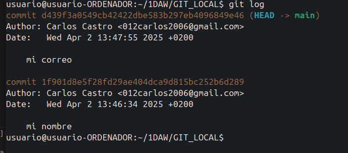
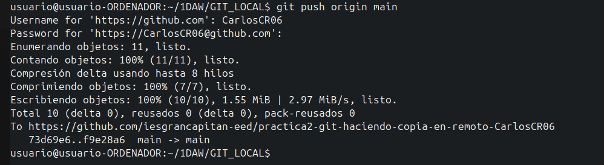
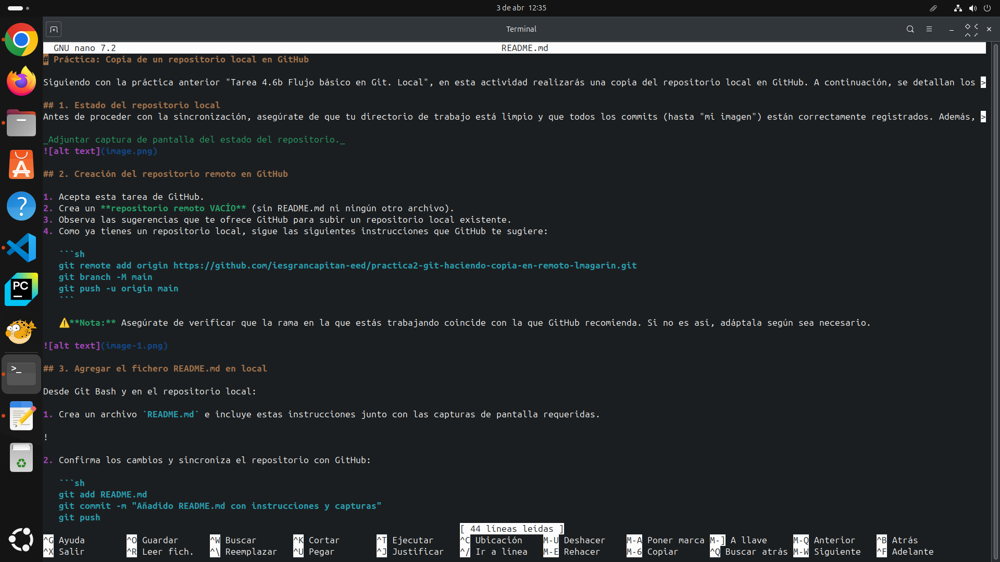

# Práctica: Copia de un repositorio local en GitHub

Siguiendo con la práctica anterior "Tarea 4.6b Flujo básico en Git. Local", en esta actividad realizarás una copia del repositorio local en GitHub. A continuación, se detallan los pasos a seguir:

## 1. Estado del repositorio local
Antes de proceder con la sincronización, asegúrate de que tu directorio de trabajo está limpio y que todos los commits (hasta "mi imagen") están correctamente registrados. Además, confirma que no estás en modo **detached HEAD**, lo cual significa que el último commit debe reflejar `HEAD -> master`.

_Adjuntar captura de pantalla del estado del repositorio._


## 2. Creación del repositorio remoto en GitHub

1. Acepta esta tarea de GitHub.
2. Crea un **repositorio remoto VACÍO** (sin README.md ni ningún otro archivo).
3. Observa las sugerencias que te ofrece GitHub para subir un repositorio local existente.
4. Como ya tienes un repositorio local, sigue las siguientes instrucciones que GitHub te sugiere:

   ```sh
   git remote add origin https://github.com/iesgrancapitan-eed/practica2-git-haciendo-copia-en-remoto-lmagarin.git
   git branch -M main
   git push -u origin main
   ```

   ⚠️ **Nota:** Asegúrate de verificar que la rama en la que estás trabajando coincide con la que GitHub recomienda. Si no es así, adáptala según sea necesario.



## 3. Agregar el fichero README.md en local

Desde Git Bash y en el repositorio local:

1. Crea un archivo `README.md` e incluye estas instrucciones junto con las capturas de pantalla requeridas.



2. Confirma los cambios y sincroniza el repositorio con GitHub:

   ```sh
   git add README.md
   git commit -m "Añadido README.md con instrucciones y capturas"
   git push
   ```

_Adjuntar capturas de pantalla de los comandos ejecutados y la sincronización exitosa._
